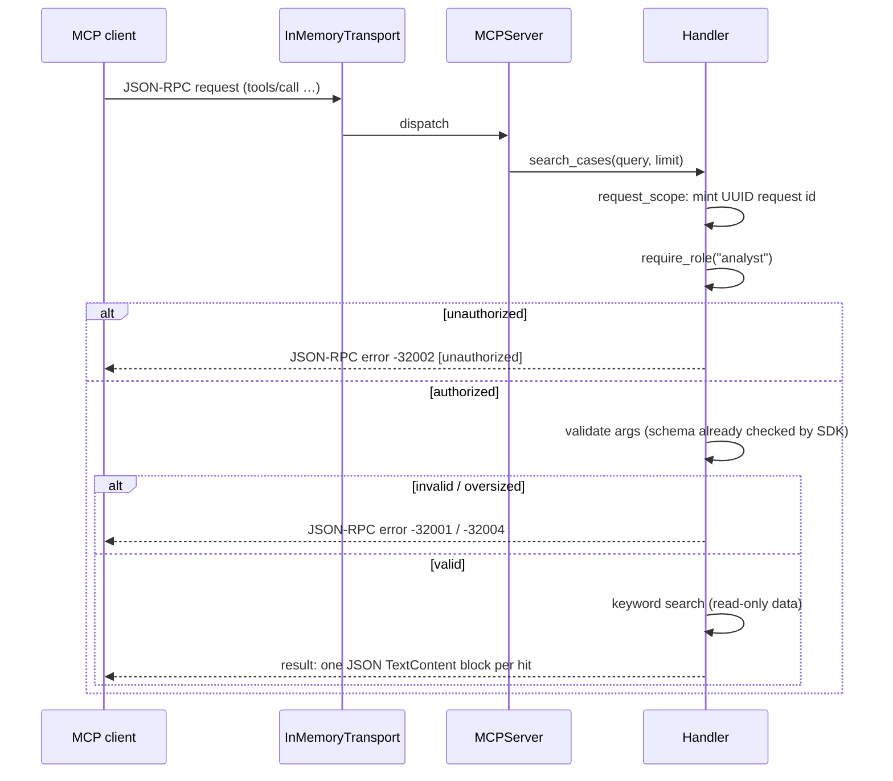

# Lab 7 — architecture notes

## What it is

A local MCP server (`MCPServer("lab7-briefs")`, SDK v2) exposing exactly
three capabilities — one resource, one tool, one prompt — wrapped in
deterministic controls. Two different in-process clients (the SDK's
`ClientSession` and a hand-rolled JSON-RPC 2.0 client) drive the same
server over `InMemoryTransport`, proving the server interoperates beyond
one SDK client. The teaching model holds: the client proposes, the
server's deterministic code decides.

## Design

**Capabilities.** `search_cases(query: str, limit: int = 5)` does a
case-insensitive substring match over `data/cases.json` and returns hits
in file order, capped by `limit`. `brief://{client_id}` returns brief text
from `data/briefs.json` for allow-listed ids only. `discovery_interview`
renders a reusable interview template for one `client_name` argument.

**Error taxonomy** (`errors.py`). Five codes, each mapped to a stable
JSON-RPC application-error code in the `-32099..-32000` range:

| taxonomy code | JSON-RPC code | raised when |
|---|---|---|
| `invalid_args` | -32001 | empty query/name, limit outside 1–50 |
| `unauthorized` | -32002 | role doesn't match the capability policy |
| `not_found` | -32003 | well-formed id not on the allow-list |
| `oversized_input` | -32004 | query/name longer than 200 chars |
| `path_traversal` | -32005 | id contains `..`, `/`, `\`, or NUL |

Handlers raise `Lab7Error`; a `request_scope` context manager translates it
to `MCPError`, which the SDK surfaces as a top-level JSON-RPC error — so
clients literally see the code. The message is prefixed `[code]` and the
code is also in `error.data.code`.

**Authorization** (`auth.py`). The current role lives in a contextvar;
`require_role()` runs first inside every guarded handler, before any data
is touched, so an unauthorized caller gets an explicit error and no data.
`search_cases` requires `analyst`; the brief resource requires `viewer`;
the prompt has no role requirement. Capability authorization runs *before*
input validation (fail closed, minimal disclosure).

**Logging** (`logging_utils.py`, stdlib only). Each handler entry mints a
UUID request id into a contextvar; a logging filter stamps it onto every
record for that call. A second filter redacts `sk-test-…` tokens from the
record's message and args before formatting, so secrets arriving inside
tool input can never land in a log line.

**Resource routing.** The template is `brief://{+client_id}` (reserved
expansion), not `brief://{client_id}`, deliberately: plain expansion makes
the SDK router refuse URIs containing `/`, so an unencoded `../secrets`
would die as "unknown resource" instead of reaching our validator.
Reserved expansion routes the raw value through, and `validate_client_id`
rejects it with the explicit `path_traversal` code. The SDK's generic
`ResourceSecurity` check is exempted for this parameter for the same
reason — our taxonomy, not the SDK's `ResourceSecurityError`, must be
what the client sees.

**Test hooks (not part of the MCP contract).** `server._test_delay_s`
makes `search_cases` sleep, so timeout/disconnect tests exercise slow
paths without polluting the tool's signature (the spec explicitly forbids
a `test_delay_s` argument).

## Sequence

## Honest caveats

1. **Contextvar vs. task boundary.** `InMemoryTransport` runs the server
   in a child task that snapshots the caller's context at transport entry.
   A role set on the contextvar *before* entering the transport is visible
   server-side for the whole session; a role changed mid-session would not
   be. Tests therefore set the role before opening the transport (one role
   per session). In production an auth layer would set the contextvar per
   request inside the server task.
2. **Two error surfaces.** Semantic failures raise taxonomy errors as
   JSON-RPC errors (assertable codes). *Schema-level* failures (e.g. wrong
   JSON types) are raised by the SDK itself as `CallToolResult(is_error=True)`
   — a normal result, not a protocol error. Tests assert both surfaces.
3. **Parent-logger filters don't apply to child records.** `Logger.callHandlers`
   walks ancestors for *handlers* but never applies an ancestor's *filters*,
   so the request-id/redaction filters must be attached to the emitting
   `lab07.server` logger itself (`get_logger` does this), not just `lab07`.
   This bit us during development; it's now covered by tests 14–15.
4. **Timeouts are client-side.** `anyio.fail_after` cancels the client's
   wait; the server-side handler keeps running until it finishes or the
   transport closes (EOF cancels in-flight handlers). The recovery test
   asserts the session and server stay usable, not that the server
   abandoned the slow work.
5. **The malicious fixture is data.** The globex brief contains a real
   injection string. The server returns it verbatim (fidelity), and the
   *client-side consumer* wraps it in `[UNTRUSTED RESOURCE DATA]`. The lab
   has no email capability at all, so the canary assertion is structural:
   the consumer never calls anything resembling `send_email`.

## Test report

`PYTHONPATH=src .venv/bin/python -m pytest tests -q` — **21/21 passing**
(stable across repeated runs), split across two clients:

- `tests/test_client1_session.py` — 17 tests via SDK `ClientSession`:
  discovery; valid tool/resource/prompt calls; schema-level and semantic
  invalid args; oversized input; path traversal (plain + encoded);
  not-found; unauthorized tool/resource; no-write-tools assertion;
  malicious-resource verbatim + boundary label + no-action canary;
  request-id uniqueness; secret redaction; timeout-then-recovery;
  disconnect-mid-call with bounded cleanup and server reuse.
- `tests/test_client2_raw.py` — 4 tests via hand-rolled JSON-RPC 2.0
  client: discovery, valid tool call, invalid args (`isError` result),
  path traversal (both forms → `-32005`).

Environment: mcp==2.2.0, pydantic==2.13.5, pytest==9.1.1, anyio==4.15.1,
Python 3.12.3. No network, no API key; every test builds a fresh server
and transport.
